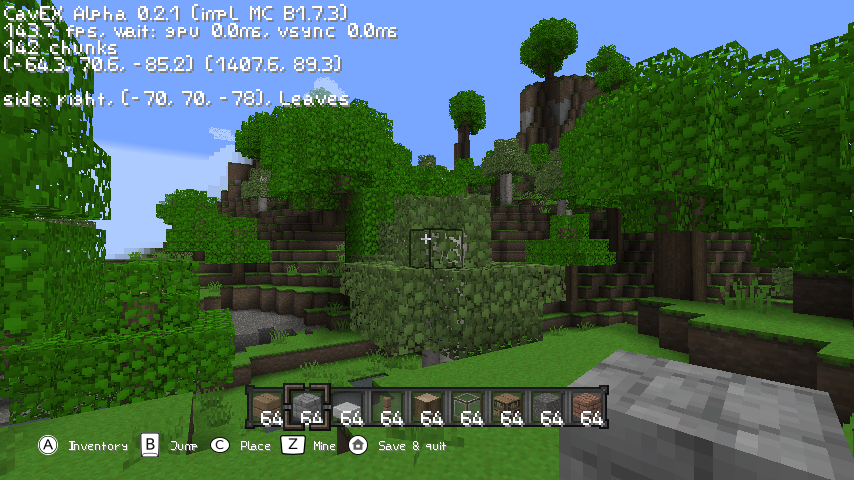

# CavEX

[](https://github.com/amahpour/CavEX/actions/workflows/tests.yml)
[](https://github.com/amahpour/CavEX/actions/workflows/tests.yml)

*Cave Explorer* is a Wii homebrew game with the goal to recreate most of the core survival aspects up until Beta 1.7.3. Any features beyond *will not* be added.

---

**Features**
* great performance on Wii (about 60fps)
* 5 chunk render distance currently
* load any beta world save
* nearly all blocks added, except redstone related
* many items from the original
* correct light propagation
* ambient occlusion on blocks

---

**Planned features** *(in no particular order, not complete)*
* main menu
* generation of new chunks
* biome colors
* ~~player physics~~
* ~~inventory management~~
* ~~block placement~~ and destruction logic
* ~~(random)~~ block updates
* ~~item actions~~
* real texture pack support
* Beta 1.7.3 multiplayer support

## Screenshot


*(from the PC version)*

## Build instructions

Unlike upstream (which ships these directories empty), this fork **vendors all
required third-party libraries** in the repository — you do not need to download
anything by hand. They live at the paths below, with thanks to their authors:

| library | location |
| --- | --- |
| [LodePNG](https://github.com/lvandeve/lodepng) | `source/lodepng/` |
| [cglm](https://github.com/recp/cglm) | `source/cglm/` |
| [cNBT](https://github.com/chmod222/cNBT) | `source/cNBT/` |
| [parson](https://github.com/kgabis/parson) | `source/parson/` |
| [M*LIB](https://github.com/P-p-H-d/mlib) | `include/m-lib/` |

### Wii

For the Wii platform you need to install the [devkitPro](https://devkitpro.org/wiki/Getting_Started) Wii/Gamecube environment. Additionally install zlib using pacman of devkitPro.

```bash
dkp-pacman -S wii-dev ppc-zlib
```

To build, simply run make in the root directory. You might need to load the cross compiler env first (required e.g. if you use [fish](https://fishshell.com/) instead of bash).

```bash
source /etc/profile.d/devkit-env.sh
make
```

There should then be a .dol file in the root directory that your Wii can run. To copy the game to your `apps/` folder, it needs to look like this:
```
cavex
├── assets
│   ├── terrain.png
│   ├── items.png
│   ├── anim.png
│   ├── default.png
│   ├── gui.png
│   └── gui2.png
├── saves
│   ├── world
│   └── ...
├── boot.dol
├── config.json
├── icon.png
└── meta.xml
```

### GNU/Linux

The game also runs on any PC with OpenGL 2.0 support, played with keyboard and
mouse. Install the build dependencies with your package manager — `zlib`,
`glfw3` and `glew` — then build and play with a single command:

```bash
make play
```

This builds the native binary, stages a run directory for it (texture pack, PC
config and a freshly generated world) and launches the game. Use `make pc` if
you just want to build the binary without running it.

Controls are WASD + mouse look, left/right mouse button to mine/place, Space to
jump, Left-Shift to sneak, E for the inventory and F2 for a screenshot. See
[`controls.md`](controls.md) for the full list.

## Tutorials

Kid-friendly, step-by-step guides for building things in-game:

* [How to make a bubble elevator](docs/tutorials/bubble-elevator.md) — stack
  bubble blocks and ride them straight up.
* [How to make fireworks](docs/tutorials/fireworks.md) — craft a firework rocket
  and set off a burst of sparks.

## Tests

Headless unit tests (no OpenGL) run via:

```bash
make test
```

This configures `build_test/`, runs **62 tests**, enforces a per-test coverage
gate (each test must cover at least one new line), and refreshes
[`badges/coverage.json`](badges/coverage.json). Commit the updated badge file
when you add or change tests.
